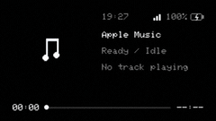

# Cardputer Now Playing
A minimalist, zero-flicker wireless display for Apple Music on macOS built for the **M5Stack Cardputer**, **Cardputer-Adv**, and **ESP32-S3**.



## Index
- [Live Demo](#live-demo)
- [Features](#features)
- [Project Structure](#project-structure)
- [How It Works](#how-it-works)
- [Hardware Pinout](#hardware-pinout)
- [Physical Controls](#physical-controls)
- [Local Development](#local-development)
- [Flashing Firmware](#flashing-firmware)
- [Credits & License](#credits--license)

## Live Demo
You can simulate the device directly in your browser or run the macOS companion bridge on your Mac with zero third-party dependencies:

```sh
# Start the companion bridge on your Mac
python3 host-companion/bridge.py
```

Once running:
- Open `http://localhost:58329/` in your browser to view the live dashboard and downscaled album art.
- In **VS Code** with the **Wokwi Simulator** extension installed, run `Cmd + Shift + P` and choose **Wokwi: Start Simulator** to preview the full display UI in real time.

## Features
- **Zero-Flicker Minimalist UI**: Uses off-screen double-buffered `GFXcanvas16` rendering on a 240x135 ST7789 IPS LCD at 20 FPS (50ms interval).
- **Curated 60-30-10 Color System**: Built on high-contrast tokens:
  - **60% Dominant**: Pitch-black canvas (`#050505`), dark header/footer strips (`#0d0d0d`), and main body text (`#e6e6e6`).
  - **30% Structural**: Brand primary (`#afbdd9`) for screen title `"Now Playing"`, active progress bar, and playhead scrubber.
  - **10% High-Impact Accents**: Warm secondary (`#f0a133`) for keyboard shortcuts, Wi-Fi signal, and charging bolt; soft accent (`#df9a9e`) for the Dynamic Island pause overlay badge.
- **Fixed 2-Line Title Layout**: Always reserves two dedicated lines for song title (`y = 24` and `y = 38`), preventing vertical layout shift. Artist (`y = 54`) and Album (`y = 70`) remain strictly anchored.
- **Symmetric 8px Layout Padding**: Uniform 8px top, bottom, left, and right margins framing a crisp 72×72 square artwork with radius 4 rounded corners and a subtle outline border.
- **Full-Width Modular Header**: Features synchronized local time on left, `"Now Playing"` in center, and live 3-bar Wi-Fi RSSI meter + battery gauge with charging indicator (`⚡`) on right.
- **Resilient NTP & Hardware RTC Timekeeping**: Built-in SNTP background synchronization with host companion timestamp fallback. Local RTC continues advancing independently, guaranteeing the header clock never drops to `--:--`.
- **Standard Control Footer**: Features dedicated control pills with vector icons and tactile keyboard hints (`[P] Prev`, `[<] -10s`, `[Spc] Play/Pause`, `[>] +10s`, `[N] Next`).
- **Seeking Support**: Built-in 10-second fast-forward and rewind controls communicating with macOS `Music.app`.
- **Synchronized Shared Clock Marquee**: Overflowing title, artist, and album text lines pause together for 10 seconds, scroll forward simultaneously at 40ms/px, park smoothly upon completion, and reset the shared 10s timer when all lines finish.
- **Dynamic Island Pause Badge**: When paused, an elegant 16×16px rounded badge (`#270c0e` with `#df9a9e` border and bars) overlays the bottom-right corner of the artwork.
- **Minimalist Idle State**: Displays clean `"Not Playing"` in a muted tone when Apple Music is idle or stopped.
- **First-Boot Captive Portal Onboarding**: On first boot or holding `G0` / pressing `s`, boots into `cardputer-nowplaying-setup` (`http://192.168.4.1`) to scan Wi-Fi networks and save credentials to NVS flash.
- **Physical Keyboard Controls**: Full Cardputer-Adv keyboard integration via TCA8418 I2C driver and USB Serial fallback.
- **Native macOS Companion Bridge**: Zero `pip` dependencies; uses built-in AppleScript (`osascript`) and macOS `sips` to downscale artwork to 72×72 16-bit RGB565 binary buffers (`/artwork.raw`).
- **Dedicated Port 58329**: Uses an obscure high dynamic port to eliminate local network conflicts with macOS AirPlay (port 5000) and standard development ports.

## Project Structure
```text
.
├── demo.gif                # Product demo preview
├── diagram.json            # Wokwi simulation circuit (ESP32-S3 + ST7789)
├── wokwi.toml              # Wokwi simulation configuration
├── host-companion/
│   ├── bridge.py           # Native macOS AppleScript & HTTP server (Port 58329)
│   ├── test_bridge.py      # Automated test verifying AppleScript query & RGB565 conversion
│   └── README.md           # Companion bridge documentation
├── firmware/
│   ├── platformio.ini      # PlatformIO build configuration (esp32s3 & cardputer-adv)
│   ├── include/
│   │   ├── config.h        # Pin assignments, layout metrics & 60-30-10 color tokens
│   │   ├── config_manager.h# NVS Preferences storage & captive portal onboarding
│   │   ├── keyboard_driver.h# Cardputer-Adv TCA8418 I2C & matrix driver
│   │   ├── display_ui.h    # Double-buffered graphics, standard header & footer
│   │   ├── music_client.h  # Dynamic HTTP client, playback controls & JSON parser
│   │   └── arduino_compat.h# Arduino compatibility helpers
│   └── src/
│       ├── main.cpp        # Application loop, keyboard handler & render tick
│       ├── config_manager.cpp# Captive portal web server & DNS responder
│       ├── keyboard_driver.cpp# I2C TCA8418 keypad controller & serial fallback
│       ├── display_ui.cpp  # GFXcanvas16 double-buffering, standard header/footer
│       └── music_client.cpp# Network polling, controls & binary artwork stream
└── releases/               # Factory and firmware release binaries
```
`firmware/src/main.cpp` coordinates display updates, keyboard scanning, and HTTP polling. `host-companion/bridge.py` queries `Music.app` and converts album art into raw RGB565 bytes.

## How It Works
1. **Host Companion (`bridge.py`)**:
   - Queries `Music.app` via AppleScript / JXA every 500ms to fetch track name, artist, album, duration, elapsed time, player state, and local time.
   - Extracts album art and downscales it to 72×72 px using macOS's built-in `sips` tool.
   - Converts the thumbnail directly to a 10,368-byte big-endian RGB565 binary buffer (`/artwork.raw`).
   - Serves metadata at `/api/now-playing` and handles playback control requests (`/api/toggle`, `/api/next`, `/api/previous`, `/api/forward`, `/api/backward`).
   - Hosts a companion dashboard with silent client-side JSON polling and asynchronous control buttons.

2. **ESP32 Firmware**:
   - Connects to Wi-Fi using saved credentials from NVS flash (configured via the captive portal).
   - Syncs real-time clock via NTP and companion bridge epoch timestamps to run local RTC timekeeping.
   - Polls `/api/now-playing` every 3 seconds, caching `artwork_id` to only fetch the binary cover art when the track changes.
   - Runs a 50ms display loop with local 1-second timestamp interpolation for smooth second-by-second progress bar progression.
   - Blits the entire frame buffer to the ST7789 display over SPI in a single burst, eliminating visual tear and flicker.

## Hardware Pinout

| Signal | ESP32-S3 (Wokwi) | M5Stack Cardputer-Adv (K132-Adv) | M5Stack Cardputer v1.x | Description |
|---|---|---|---|---|
| **MOSI / SDA** | GPIO 11 | GPIO 35 | GPIO 6 | SPI Display Data |
| **SCLK / SCL** | GPIO 12 | GPIO 36 | GPIO 8 | SPI Display Clock |
| **CS** | GPIO 10 | GPIO 37 | GPIO 37 | Display Chip Select |
| **DC** | GPIO 9 | GPIO 34 | GPIO 4 | Display Data / Command |
| **RST** | GPIO 8 | GPIO 33 | GPIO 33 | Display Reset |
| **BL** | N/A | GPIO 38 | GPIO 38 | Backlight Power / Control |
| **BAT_ADC** | N/A | GPIO 10 | GPIO 10 | Battery Voltage ADC (Ratio 2.0) |
| **KEYPAD_SDA** | N/A | GPIO 8 | Matrix | TCA8418 I2C Keyboard SDA |
| **KEYPAD_SCL** | N/A | GPIO 9 | Matrix | TCA8418 I2C Keyboard SCL |
| **KEYPAD_INT** | N/A | GPIO 11 | Matrix | TCA8418 I2C Keypad Interrupt |
| **BTN_SETUP** | GPIO 0 | GPIO 0 (G0) | GPIO 0 (G0) | Setup Portal Button |

## Physical Controls
When running on the Cardputer / Cardputer-Adv, you have full playback and device controls directly from the physical keyboard (and via USB Serial monitor):

| Key | Action | Endpoint | Footer Pill |
|---|---|---|---|
| **`p`** or **`P`** | Previous Track | `POST /api/previous` | `[P] Prev` |
| **`,`** or **`<`** or **`[`** | Seek Backward (-10s) | `POST /api/backward` | `[<] -10s` |
| **`Space`** | Play / Pause Toggle | `POST /api/toggle` | `[Spc] Play/Pause` |
| **`.`** or **`>`** or **`]`** | Seek Forward (+10s) | `POST /api/forward` | `[>] +10s` |
| **`n`** or **`N`** | Next Track | `POST /api/next` | `[N] Next` |
| **`s`** or **`G0`** | Re-enter Wi-Fi Setup Portal | Spawns AP mode (`192.168.4.1`) | `[G0] Setup` |
| **`r`** or **`R`** | Reboot Device (in Setup Screen) | Restarts ESP32 | `[R] Reboot` |


## Local Development
To build and customize the project locally, ensure you have PlatformIO and Python 3 installed.

```sh
# 1. Start the host companion bridge
python3 host-companion/bridge.py

# 2. Build firmware for the Wokwi simulator
cd firmware && pio run -e esp32s3

# 3. Or build firmware for Cardputer-Adv
cd firmware && pio run -e cardputer-adv
```

### Running in Wokwi Simulator
1. Install the **Wokwi Simulator** extension in VS Code.
2. Build the `esp32s3` environment (`cd firmware && pio run -e esp32s3`).
3. Press `Cmd + Shift + P` and select **Wokwi: Start Simulator**.
4. The virtual ESP32-S3 connects to `Wokwi-GUEST`, queries `http://host.wokwi.internal:58329`, and renders real-time track updates.

## Flashing Firmware
Pre-built release binaries are available on the **[GitHub Releases v1.0.0](https://github.com/amansanoj/cardputer-nowplaying/releases/tag/v1.0.0)** page:

- **`cardputer-adv-v1.0.0-factory.bin`**: Complete all-in-one factory image (bootloader + partition table + boot_app0 + application firmware). Flash directly at offset **`0x0`**.
- **`cardputer-adv-v1.0.0-firmware.bin`**: Application firmware only (flash at offset `0x10000`).
- **`wokwi-esp32s3-v1.0.0-firmware.bin`**: Firmware target for Wokwi Simulator or generic ESP32-S3 DevKits.

### Option 1: ESP Web Flasher (Zero Install)
1. Open [ESP Web Flasher](https://espressif.github.io/esptool-js/) in Chrome or Edge.
2. Connect your Cardputer via USB and click **Connect** (115200 or 1500000 baud).
3. Select `cardputer-adv-v1.0.0-factory.bin` at offset **`0x0`**.
4. Click **Program / Flash**.

### Option 2: esptool.py
```sh
esptool.py --chip esp32s3 write_flash 0x0000 cardputer-adv-v1.0.0-factory.bin
```

## Credits & License
Created by [Aman Sanoj](https://github.com/amansanoj). Built with Adafruit GFX, Arduino ESP32, and macOS AppleScript. Open-source under the MIT License.
